```python
import pandas as pd
from datetime import datetime

## Importing data from csv files based on each league
league_data = {}
league_data['Blight'] = pd.read_csv('Blight.2019-09-06.2019-12-09.currency.csv', sep=';')
league_data['Legion'] = pd.read_csv('Legion.2019-06-07.2019-09-02.currency.csv', sep=';')
league_data['Synthesis'] = pd.read_csv('Synthesis.2019-03-08.2019-06-04.currency.csv', sep=';')
league_data['Betrayal'] = pd.read_csv('Betrayal.2018-12-07.2019-03-05.currency.csv', sep=';')
league_data['Delve'] = pd.read_csv('Delve.2018-08-31.2018-12-03.currency.csv', sep=';')

## Data Cleaning
# Remove 'Confidence' column from all data sets
# Only keep items that are in focus items
focus_items = ['Orb of Alchemy', 'Orb of Fusing', 'Divine Orb', 'Exalted Orb', 'Mirror of Kalandra', 'Orb of Annulment']
start_dates = {}


for league in league_data:
    data = league_data[league]
    data = league_data[league].drop('Confidence', axis=1)
    data = data[(data['Get'].isin(focus_items)) & (data['Pay'] == 'Chaos Orb')]
    
    league_data[league] = data.reset_index(drop=True)
    # Save the start date of each league
    start_dates[league] = datetime.strptime(league_data[league]['Date'][0], '%Y-%m-%d')
```


```python
## Data Shaping
# Add column that sets the relative day from start date of each league
for league in league_data:
    data = league_data[league]
    start_date = start_dates[league]
    relative_day = []
    
    for date in data['Date']:
        converted_date = datetime.strptime(date, '%Y-%m-%d')
        date_dif = (converted_date - start_date).days
        relative_day += [date_dif + 1]
        
    data['Day'] = relative_day
    
# Combining the individual leagues into one dataframe
combined_data = pd.concat(league_data.values(), axis=0)
    
```


```python
import matplotlib.pyplot as plt

focus_items = ['Orb of Alchemy', 'Orb of Fusing', 'Divine Orb', 'Exalted Orb', 'Mirror of Kalandra', 'Orb of Annulment']
    
# For each item, create a seperate axis
axs = {}
for item in focus_items:
    fig, ax = plt.subplots()
    ax.set_ylabel('Chaos Orbs/{}'.format(item))
    axs[item] = ax
    
# Plot all 5 regions onto one plot for each item
for league, data in combined_data.groupby(['League']):
    for item in focus_items:
        item_data = data[data.Get == item]
        item_data.plot(x='Day', y='Value', kind='line', title=item, ax=axs[item], label=league, )
        
plt.show()
```


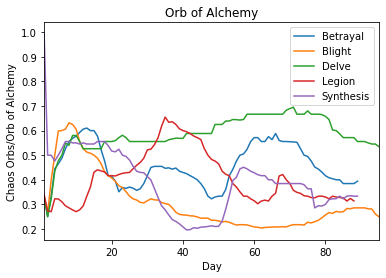


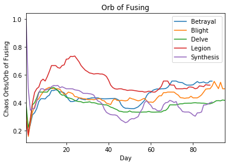


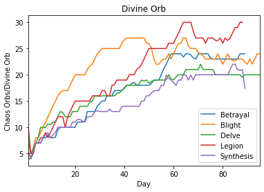


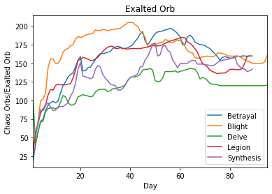


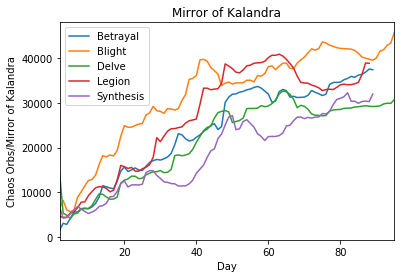


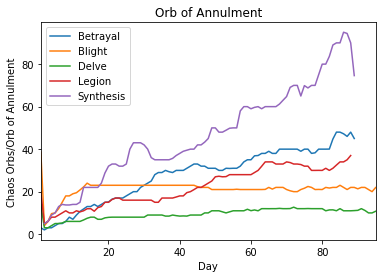


```python
## Plot the average price across all 5 regions for each item


# Find last day that have data for all regions across each item
last_day = {}
for item, item_data in combined_data.groupby(['Get']):
    days = []
    for league, data in item_data.groupby(['League']):
        days += [data['Day'].max()]
        
    last_day[item] = min(days)
    
# Create a new dataframe for the average values and create a seperate plot for each item
for item, item_data in combined_data.groupby(['Get']):
    dict_data = {
        'Average Values': [],
        'Day': list(range(1,last_day[item]+1))
    }
    
    # Find the average value of each day
    for day in range(1, last_day[item]+1):
        dict_data['Average Values'] += [item_data[item_data.Day == day]['Value'].mean()]
        
    # Create plot from the dataframe to visualize the max trend
    df = pd.DataFrame.from_dict(dict_data)
    ax = df.plot(x='Day', y='Average Values', kind='line', title=item)
    ax.set_ylabel('Average Chaos Orb/{}'.format(item))
    
    max_value = df['Average Values'].max()
    max_day = df[df['Average Values'] == max_value]['Day'].reset_index(drop=True)[0]
    print('{} reached a max value of {} on {}.'.format(item, round(max_value, 2), max_day))

```

    Divine Orb reached a max value of 24.39 on 65.
    Exalted Orb reached a max value of 173.37 on 54.
    Mirror of Kalandra reached a max value of 35177.69 on 88.
    Orb of Alchemy reached a max value of 0.52 on 15.
    Orb of Annulment reached a max value of 41.84 on 86.
    Orb of Fusing reached a max value of 0.54 on 14.


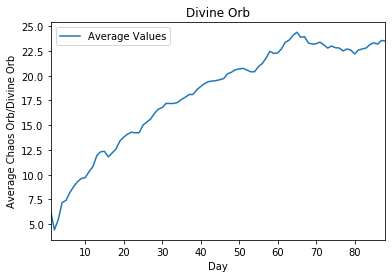


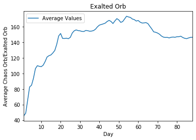


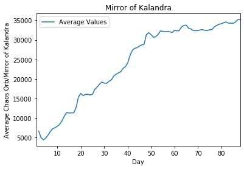


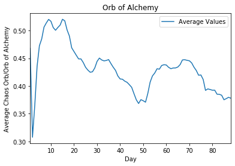


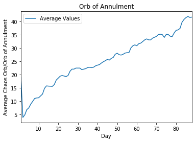


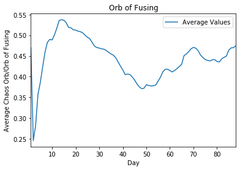

