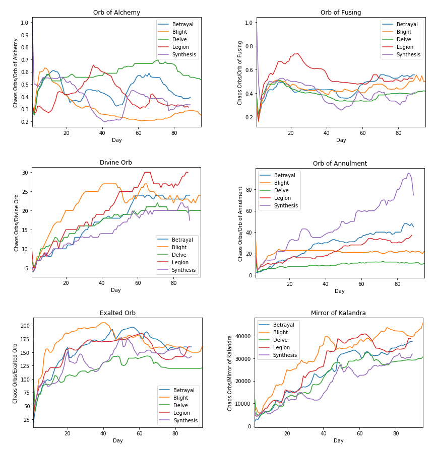
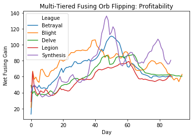
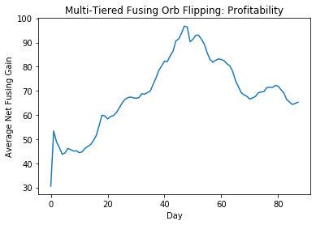

# An Analysis of the Path of Exile League Economy


## Introduction

<p> Path of Exile (PoE) is a MMOARPG (Massively Multiplayer Online Action Role Playing Game) developed by Grinding Gear Games. Released in 2013, with the support of crowdfunding, the game has since grown greatly, having hundreds of thousands of players playing with the release of each patch. The premise of the game is that the player is an exile who has been banished to the land of Wraeclast finding nothing but writhing horrors, murderous beasts, and ravenous undead. Throughout this game the player is gathering wepons, gems, and power. The exile travels the forsaken lands to find answers as to what has corrupted the land, killing monsters and even gods; to the point that who the world can no longer distinguish who the real monster is. </p>

<p> Our tutorial is going to be analysing the economy of PoE and finding optimal ways of making in game currency by looking at trends in the pricing of in-game currency items. We are going to be observing the trends in the value of currency items relative to the item Chaos Orb, as well as a the efficiency of a common money making method known as flipping.</p>

### Better understanding PoE's economy
<p> One of the biggest differences from other games is that in most MMOs one would kill monsters and expect some sort of monetary reward like gold. However, in PoE killing monsters rewards players with a variety of orbs which serves as the currency. These currency orbs are not only currency, but double as a usable item which can be used to affect items, for example: Chaos orbs which removes all the stats on an item and rerolls completely new stat values and properties. The inherent value in these currencies comes from how they are essentially used to gamble on items, with players trying to use them in order to try and upgrade their items to be stronger. However conversely, players can also just save up currency and buy a better item from another player. </p>

<p> The game economy is also completely set by the players. The developers play no hand in determining the price of an item so it is only market supply and demand that can determine the prices of items. An item can have an incredibly rare drop rate, however, if there is no demand for it then is sold for pocket change. The economy shares many properties that one would expect with a normal market, however it has some quirks that makes an analysis of the PoE economy incredibly interesting.</p>

<p> Below are some of the key points that one would need to know to help better understand the PoE economy: </p>

- Path of Exile operates on a system that is known as Leagues. Roughly every 3 months the game receives a major patch which introduces new mechanics, items, and content but also wipes out all existing characters and items from the previous league. This gives the economy of the game a fresh start every 3 months, which allows us to track trends in the valuation of currency across leagues. While the prices of relative price of currency items tends to stabilize as each league progresses, the first month’s economy is incredibly volatile, and a lot of money can be made by understanding the demand for currency items and correctly playing the market. 

- In PoE, people tend to pay for convenience. Unlike most games, there is not actual in-game designated marketplace. People have to search up on a <a href="http://poe.trade/">3rd party website</a>, for what they want, then message the player for it, and then go to their “hideout” to trade with them. This makes it so that people who want to buy bulk amounts of items, tend to pay a premium to spare them the inconvenience of having to go out of their way to complete multiple trades with different people. This allows for a certain margin of upricing that can be deemed acceptable by the buyer, thus allowing the seller to generate higher profit margins. Because of this bulk upricing, the seller holds an upper hand in trades, and has far more power in dictating price. In most cases buyers are willing to pay premiums of up to even 25% in order to save themselves time.

<p> It should also be noted that while there are many different currency items in the game. The Chaos Orb tends to be used as the basis for all pricing. For the most part, the price of items tends to be listed in terms of Chaos Orbs. Because of this we fact, we are mostly going to refer to our prices in terms of Chaos Orbs as that is the most commonly used currency.</p>

### Data Source
<p> Poeninja is a webstie which has been logging trade data for each league since 2017. Using their datasets found at: <a href="https://poe.ninja/data">poe.ninja</a>, we are going to be taking data from the previous 5 leagues: <a href="https://pathofexile.gamepedia.com/Blight_league">Blight</a>, <a href="https://pathofexile.gamepedia.com/Legion_league">Legion</a>, <a href="https://pathofexile.gamepedia.com/Synthesis_league">Synthesis</a>, <a href="https://pathofexile.gamepedia.com/Betrayal_league">Betrayal</a>, and <a href="https://pathofexile.gamepedia.com/Delve_league">Delve</a>. </p>
    
<p> Our tutorial is going to be analysing:</p>
 1. The currency pricing trends as each league goes on
 2. The profitability of flipping currency

### Getting Started

<p> We are going to be utilizing the following imported libraries </p>
```python
import pandas as pd
import numpy as np
import matplotlib.pyplot as plt
```
## Observing currency pricing trends 
    
<p> First we are going to obeserve the trends in pricing of some of the more widely/useful traded currency items. The point of this is to see which items tend to increase in price the greatest as a league goes on, this way we will know which items to hoard at the beginning of the league in order to sell later to make the most profit. Every item is going to be compared to its price in <a href="https://pathofexile.gamepedia.com/Chaos_Orb">Chaos Orbs</a> as Chaos Orbs are used by players as the main traded currency. </p>
<p> The currency items we are going to be observing are: </p>
 - <a href="https://pathofexile.gamepedia.com/Orb_of_Alchemy">Orb of Alchemy</a>
 - <a href="https://pathofexile.gamepedia.com/Orb_of_Fusing">Orb of Fusing</a>
 - <a href="https://pathofexile.gamepedia.com/Divine_Orb">Divine Orb</a>
 - <a href="https://pathofexile.gamepedia.com/Orb_of_Annulment">Orb of Annulment</a>
 - <a href="https://pathofexile.gamepedia.com/Exalted_Orb">Exalted Orb</a>
 - <a href="https://pathofexile.gamepedia.com/Mirror_of_Kalandra">Mirror of Kalandra</a>
    
<p> We are going to import all of our data into a DataFrame. Since we are observing 5 different leagues we are only going to display the table for Legion league in order to avoid unnecessary redunancy as all of the tables will be analysed in the same way. </p>

```python
## Importing data from csv files based on each league
    league_data = {}
    league_data['Blight'] = pd.read_csv('Blight.2019-09-06.2019-12-09.currency.csv', sep=';')
    league_data['Legion'] = pd.read_csv('Legion.2019-06-07.2019-09-02.currency.csv', sep=';')
    league_data['Synthesis'] = pd.read_csv('Synthesis.2019-03-08.2019-06-04.currency.csv', sep=';')
    league_data['Betrayal'] = pd.read_csv('Betrayal.2018-12-07.2019-03-05.currency.csv', sep=';')
    league_data['Delve'] = pd.read_csv('Delve.2018-08-31.2018-12-03.currency.csv', sep=';')
    league_data['Legion'].head()
```
<div>
<style scoped>
    .dataframe tbody tr th:only-of-type {
        vertical-align: middle;
    }

    .dataframe tbody tr th {
        vertical-align: top;
    }

    .dataframe thead th {
        text-align: right;
    }
</style>
<table border="1" class="dataframe">
  <thead>
    <tr style="text-align: right;">
      <th></th>
      <th>League</th>
      <th>Date</th>
      <th>Get</th>
      <th>Pay</th>
      <th>Value</th>
      <th>Confidence</th>
    </tr>
  </thead>
  <tbody>
    <tr>
      <td>0</td>
      <td>Legion</td>
      <td>6/7/2019</td>
      <td>Orb of Alchemy</td>
      <td>Chaos Orb</td>
      <td>0.34000</td>
      <td>High</td>
    </tr>
    <tr>
      <td>1</td>
      <td>Legion</td>
      <td>6/8/2019</td>
      <td>Orb of Alchemy</td>
      <td>Chaos Orb</td>
      <td>0.27347</td>
      <td>High</td>
    </tr>
    <tr>
      <td>2</td>
      <td>Legion</td>
      <td>6/9/2019</td>
      <td>Orb of Alchemy</td>
      <td>Chaos Orb</td>
      <td>0.27028</td>
      <td>High</td>
    </tr>
    <tr>
      <td>3</td>
      <td>Legion</td>
      <td>6/10/2019</td>
      <td>Orb of Alchemy</td>
      <td>Chaos Orb</td>
      <td>0.32258</td>
      <td>High</td>
    </tr>
    <tr>
      <td>4</td>
      <td>Legion</td>
      <td>6/11/2019</td>
      <td>Orb of Alchemy</td>
      <td>Chaos Orb</td>
      <td>0.32196</td>
      <td>High</td>
    </tr>
  </tbody>
</table>
</div>

<p>
The above table is the dataset for currency items in Legion League. Further information on what exactly each element would be in game is also linked. The columns are:
</p>
 - <a href="https://pathofexile.gamepedia.com/League">League</a>
 - <a href="https://www.merriam-webster.com/dictionary/date">Date</a>
 - Get: What the buyer is trying to buy
 - <a href="https://pathofexile.gamepedia.com/Currency">Pay</a>: The currency with which the buyer is paying in
 - Value: How many of the currency the buyer must pay for 1 of the "Get" item
 - Confidence: Poeninja's confidence in the value
 
 <p> Now we must clean the data by removing unwanted rows, removing any rows that do not contain data that we are interested in. </p>

```python
## Data Cleaning
# Remove 'Confidence' column from all data sets
# Only keep items that are in focus items
focus_items = ['Orb of Alchemy', 'Orb of Fusing', 'Divine Orb', 'Exalted Orb', 'Mirror of Kalandra', 'Orb of Annulment']
start_dates = {}


for league in league_data:
    data = league_data[league]
    data = league_data[league].drop('Confidence', axis=1)
    data = data[(data['Get'].isin(focus_items)) & (data['Pay'] == 'Chaos Orb')]
    
    league_data[league] = data.reset_index(drop=True)
    # Save the start date of each league
    start_dates[league] = datetime.strptime(league_data[league]['Date'][0], '%Y-%m-%d')
```
<p> Then we need to reshape the data in the columns so that it shall be usable. In our case we are going to look at each league relative to the first day of that given league. That way it shall be easier to graph each point over time. </p>

```python
## Data Shaping
# Add column that sets the relative day from start date of each league
for league in league_data:
    data = league_data[league]
    start_date = start_dates[league]
    relative_day = []
    
    for date in data['Date']:
        converted_date = datetime.strptime(date, '%Y-%m-%d')
        date_dif = (converted_date - start_date).days
        relative_day += [date_dif + 1]
        
    data['Day'] = relative_day
    
# Combining the individual leagues into one dataframe
combined_data = pd.concat(league_data.values(), axis=0)
```

<p> Finally we plot our data. We are first going to look at the prices of each item for the 5 specified leagues. </p>



<p> We can also observe the averages of the values of each graph. And use this graph to determine when the values of each given currency tends to reach its peak.</p>

```python
# Find last day that have data for all regions across each item
last_day = {}
for item, item_data in combined_data.groupby(['Get']):
    days = []
    for league, data in item_data.groupby(['League']):
        days += [data['Day'].max()]
        
    last_day[item] = min(days)
    
# Create a new dataframe for the average values and create a seperate plot for each item
for item, item_data in combined_data.groupby(['Get']):
    dict_data = {
        'Average Values': [],
        'Day': list(range(1,last_day[item]+1))
    }
    
    # Find the average value of each day
    for day in range(1, last_day[item]+1):
        dict_data['Average Values'] += [item_data[item_data.Day == day]['Value'].mean()]
        
    # Create plot from the dataframe to visualize the max trend
    df = pd.DataFrame.from_dict(dict_data)
    ax = df.plot(x='Day', y='Average Values', kind='line', title=item)
    ax.set_ylabel('Average Chaos Orb/{}'.format(item))
    
    max_value = df['Average Values'].max()
    max_day = df[df['Average Values'] == max_value]['Day'].reset_index(drop=True)[0]
    print('{} reached a max value of {} on {}.'.format(item, round(max_value, 2), max_day))

```
    Divine Orb reached a max value of 24.39 on 65.
    Exalted Orb reached a max value of 173.37 on 54.
    Mirror of Kalandra reached a max value of 35177.69 on 88.
    Orb of Alchemy reached a max value of 0.52 on 15.
    Orb of Annulment reached a max value of 41.84 on 86.
    Orb of Fusing reached a max value of 0.54 on 14.


<p> From our data we can see that Orb of Fusings, Orbs of Alchemys, and Exalted Orbs all have the most sharp increases in price over the smallest span of time. Divine Orbs, Orb of Annulments, and Mirrors tend to steadily increase as the league goes on, however this makes its short term profitability quite low so they are not good targets for money making. However, Orb of Alchemys can be seen to have fairly steep drops in price going into the 20 to 50 day mark, while exalts tend to stabilize and fusings slightly decreasing. For our goal of making short term profit in the beginning of the league, it would seem that hoarding Orbs of Fusing and Alchemys can be quite profitale should they be sold within the first 10-15 days. Howveer, for longer term investment Exalted orbs tend to continue to increase in value intil the 1 month mark.</p>

## Observing the profitability of flipping currency

<p> Next we will observe the profitability of flipping currency. Flipping currency is when one takes one currency then sells it for another, then subsequenty sells the currency they just received for the same currency originally. This makes money as these transations tend to occur in bulk, and was previously discussed, bulk sales allow for the seller to upcharge on on the price, thus allowing them to make a net gain. It is largely known in the community that flipping is profitable, however we wanted to observe if its profitability if we were to flip a currency into multiple different currencies and when in the league this would be most optimal. We call this process multi tiered flipping. </p>
    
<p> We are going to be flipping Orbs of Fusing into Exalted Orbs, then Exalted Orbs into Chaos Orbs, and finally Chaos Orbs into Orbs of Fusing. We are only going to be displaying the analysis for Legion League, however our data will have data from all 5 leagues that we are observing. </p>

<p> First we clean the data to only contain the ratios between all of the currencies we need.</p>

```python
legion = pd.read_csv('Legion.2019-06-07.2019-09-02.currency.csv', sep=';')

# Find conversion between Chaos and Exalted as a simpler multiplier value
legion_etoc = legion[(legion['Get'] == 'Chaos Orb') & (legion['Pay'] == 'Exalted Orb')].reset_index(drop=True)
legion_ctoe = legion[(legion['Get'] == 'Exalted Orb') & (legion['Pay'] == 'Chaos Orb')].reset_index(drop=True)

# Find conversion from Chaos Orbs to Orbs of Fusing
legion_ctof = legion[(legion['Get'] == 'Orb of Fusing') & (legion['Pay'] == 'Chaos Orb')].reset_index(drop=True)

# Use reciprocal to find value received with payment of 1 item
for index, row in legion_etoc.iterrows():
    legion_etoc.loc[index, 'Chaos per Exalted'] = 1 / legion_etoc.loc[index, 'Value']
    legion_ctoe.loc[index, 'Exalted per Chaos'] = 1 / legion_ctoe.loc[index, 'Value']
    legion_ctof.loc[index, 'Fusing per Chaos'] = 1 / legion_ctof.loc[index, 'Value']

legion_ctoe = legion[(legion['Get'] == 'Exalted Orb') & (legion['Pay'] == 'Chaos Orb')].reset_index(drop=True)
legion_ftoe = legion[(legion['Get'] == 'Chaos Orb') & (legion['Pay'] == 'Orb of Fusing')].reset_index(drop=True)

# Calculate what percentage of an Exalted Orb that one Orb of Fusing is
for index, row in legion_ftoe.iterrows():
    legion_ftoe.loc[index, 'Chaos per Fusing'] = 1 / legion_ftoe.loc[index, 'Value']
    legion_ftoe.loc[index, 'Exalted per Fusing'] = legion_ftoe.loc[index, 'Chaos per Fusing'] / legion_ctoe.loc[index, 'Value']
```

<p> We then calculate the starting amount of fusings that we would have, and multiply it by the ratios we previously caluclated in order to obtain how much money we are making. </p>

```python
# Slice and format dataframe to store the start and end Orb of Fusing numbers
legion_fusing = legion[(legion['Get'] == 'Chaos Orb') & (legion['Pay'] == 'Exalted Orb')]
legion_fusing = legion_fusing.reset_index(drop=True).drop('Get', axis=1).drop('Pay', axis=1).drop('Value', axis=1).drop('Confidence', axis=1)

for index, row in legion_fusing.iterrows():
    # Take reciprocal of Exalted per Fusing to find starting number of Fusings
    legion_fusing.loc[index, 'Start Fusings'] = 1 / legion_ftoe.loc[index, 'Exalted per Fusing']
    # Take the number of Chaos Orbs that one Exalted Orb is worth and find the
    # amount of Fusing Orbs that can be purchased
    legion_fusing.loc[index, 'End Fusings'] = legion_etoc.loc[index, 'Chaos per Exalted'] * legion_ctof.loc[index, 'Fusing per Chaos']

legion_fusing
```

<div>
<style scoped>
    .dataframe tbody tr th:only-of-type {
        vertical-align: middle;
    }

    .dataframe tbody tr th {
        vertical-align: top;
    }

    .dataframe thead th {
        text-align: right;
    }
</style>
<table border="1" class="dataframe">
  <thead>
    <tr style="text-align: right;">
      <th></th>
      <th>League</th>
      <th>Date</th>
      <th>Start Fusings</th>
      <th>End Fusings</th>
    </tr>
  </thead>
  <tbody>
    <tr>
      <th>0</th>
      <td>Legion</td>
      <td>2019-06-07</td>
      <td>263.697201</td>
      <td>23.968542</td>
    </tr>
    <tr>
      <th>1</th>
      <td>Legion</td>
      <td>2019-06-08</td>
      <td>331.017240</td>
      <td>330.026403</td>
    </tr>
    <tr>
      <th>2</th>
      <td>Legion</td>
      <td>2019-06-09</td>
      <td>241.500000</td>
      <td>234.430844</td>
    </tr>
    <tr>
      <th>3</th>
      <td>Legion</td>
      <td>2019-06-10</td>
      <td>207.500000</td>
      <td>202.403849</td>
    </tr>
    <tr>
      <th>4</th>
      <td>Legion</td>
      <td>2019-06-11</td>
      <td>191.350000</td>
      <td>185.960600</td>
    </tr>
    <tr>
      <th>...</th>
      <td>...</td>
      <td>...</td>
      <td>...</td>
      <td>...</td>
    </tr>
    <tr>
      <th>83</th>
      <td>Legion</td>
      <td>2019-08-29</td>
      <td>283.376180</td>
      <td>272.080332</td>
    </tr>
    <tr>
      <th>84</th>
      <td>Legion</td>
      <td>2019-08-30</td>
      <td>286.000000</td>
      <td>277.568376</td>
    </tr>
    <tr>
      <th>85</th>
      <td>Legion</td>
      <td>2019-08-31</td>
      <td>300.538223</td>
      <td>283.414466</td>
    </tr>
    <tr>
      <th>86</th>
      <td>Legion</td>
      <td>2019-09-01</td>
      <td>316.402218</td>
      <td>296.409485</td>
    </tr>
    <tr>
      <th>87</th>
      <td>Legion</td>
      <td>2019-09-02</td>
      <td>316.800000</td>
      <td>300.155577</td>
    </tr>
  </tbody>
</table>
<p>88 rows × 4 columns</p>
</div>

<p> From these rows it would appear that there is not really much profit to be made from simply flipping currency. However, these values were generated using the raw ratios for each day. Should we adjust each ratio with a normal bulk upcharging price of 10% we can see the following. </p>

```python
# Set the percentage that we will upcharge for bulk selling
premium = 0.1
for index, row in legion_fusing.iterrows():
    # Number of Fusing Orbs that are saved when purchasing an Exalted Orb
    legion_fusing.loc[index, 'Fusings Saved'] = legion_fusing.loc[index, 'Start Fusings'] * premium
    # Number of Fusing Orbs that can be purchased at the end by charging a premium
    legion_fusing.loc[index, 'Bulk Fusing Buy'] = legion_fusing.loc[index, 'End Fusings'] * (1 + premium)
    # Add back the Fusing Orbs that were saved at the beginning
    legion_fusing.loc[index, 'New End Fusings'] = legion_fusing.loc[index, 'Fusings Saved'] + legion_fusing.loc[index, 'Bulk Fusing Buy']
    # Take the difference between normal selling and selling with a premium
    legion_fusing.loc[index, 'Net Fusing Gain'] = legion_fusing.loc[index, 'New End Fusings'] - legion_fusing.loc[index, 'End Fusings']
    # Add day column to make easier to plot
    legion_fusing.loc[index, 'Day'] = index
    
legion_fusing
```

<div>
<style scoped>
    .dataframe tbody tr th:only-of-type {
        vertical-align: middle;
    }

    .dataframe tbody tr th {
        vertical-align: top;
    }

    .dataframe thead th {
        text-align: right;
    }
</style>
<table border="1" class="dataframe">
  <thead>
    <tr style="text-align: right;">
      <th></th>
      <th>League</th>
      <th>Date</th>
      <th>Start Fusings</th>
      <th>End Fusings</th>
      <th>Fusings Saved</th>
      <th>Bulk Fusing Buy</th>
      <th>New End Fusings</th>
      <th>Net Fusing Gain</th>
      <th>Day</th>
    </tr>
  </thead>
  <tbody>
    <tr>
      <th>0</th>
      <td>Legion</td>
      <td>2019-06-07</td>
      <td>263.697201</td>
      <td>23.968542</td>
      <td>26.369720</td>
      <td>26.365396</td>
      <td>52.735117</td>
      <td>28.766574</td>
      <td>0.0</td>
    </tr>
    <tr>
      <th>1</th>
      <td>Legion</td>
      <td>2019-06-08</td>
      <td>331.017240</td>
      <td>330.026403</td>
      <td>33.101724</td>
      <td>363.029043</td>
      <td>396.130767</td>
      <td>66.104364</td>
      <td>1.0</td>
    </tr>
    <tr>
      <th>2</th>
      <td>Legion</td>
      <td>2019-06-09</td>
      <td>241.500000</td>
      <td>234.430844</td>
      <td>24.150000</td>
      <td>257.873928</td>
      <td>282.023928</td>
      <td>47.593084</td>
      <td>2.0</td>
    </tr>
    <tr>
      <th>3</th>
      <td>Legion</td>
      <td>2019-06-10</td>
      <td>207.500000</td>
      <td>202.403849</td>
      <td>20.750000</td>
      <td>222.644234</td>
      <td>243.394234</td>
      <td>40.990385</td>
      <td>3.0</td>
    </tr>
    <tr>
      <th>4</th>
      <td>Legion</td>
      <td>2019-06-11</td>
      <td>191.350000</td>
      <td>185.960600</td>
      <td>19.135000</td>
      <td>204.556660</td>
      <td>223.691660</td>
      <td>37.731060</td>
      <td>4.0</td>
    </tr>
    <tr>
      <th>...</th>
      <td>...</td>
      <td>...</td>
      <td>...</td>
      <td>...</td>
      <td>...</td>
      <td>...</td>
      <td>...</td>
      <td>...</td>
      <td>...</td>
    </tr>
    <tr>
      <th>83</th>
      <td>Legion</td>
      <td>2019-08-29</td>
      <td>283.376180</td>
      <td>272.080332</td>
      <td>28.337618</td>
      <td>299.288366</td>
      <td>327.625984</td>
      <td>55.545651</td>
      <td>83.0</td>
    </tr>
    <tr>
      <th>84</th>
      <td>Legion</td>
      <td>2019-08-30</td>
      <td>286.000000</td>
      <td>277.568376</td>
      <td>28.600000</td>
      <td>305.325213</td>
      <td>333.925213</td>
      <td>56.356838</td>
      <td>84.0</td>
    </tr>
    <tr>
      <th>85</th>
      <td>Legion</td>
      <td>2019-08-31</td>
      <td>300.538223</td>
      <td>283.414466</td>
      <td>30.053822</td>
      <td>311.755913</td>
      <td>341.809735</td>
      <td>58.395269</td>
      <td>85.0</td>
    </tr>
    <tr>
      <th>86</th>
      <td>Legion</td>
      <td>2019-09-01</td>
      <td>316.402218</td>
      <td>296.409485</td>
      <td>31.640222</td>
      <td>326.050434</td>
      <td>357.690656</td>
      <td>61.281170</td>
      <td>86.0</td>
    </tr>
    <tr>
      <th>87</th>
      <td>Legion</td>
      <td>2019-09-02</td>
      <td>316.800000</td>
      <td>300.155577</td>
      <td>31.680000</td>
      <td>330.171134</td>
      <td>361.851134</td>
      <td>61.695558</td>
      <td>87.0</td>
    </tr>
  </tbody>
</table>
<p>88 rows × 9 columns</p>
</div>

<p> From this table it can be seen that there are net gains for each day using this method. We then repeat this process for each league that we are observing. </p>


```python
# Blight

# Find conversion between Chaos and Exalted as a simpler multiplier value
blight_etoc = blight[(blight['Get'] == 'Chaos Orb') & (blight['Pay'] == 'Exalted Orb')].reset_index(drop=True)
blight_ctoe = blight[(blight['Get'] == 'Exalted Orb') & (blight['Pay'] == 'Chaos Orb')].reset_index(drop=True)

# Find conversion from Chaos Orbs to Orbs of Fusing
blight_ctof = blight[(blight['Get'] == 'Orb of Fusing') & (blight['Pay'] == 'Chaos Orb')].reset_index(drop=True)

# Use reciprocal to find value received with payment of 1 item
for index, row in blight_etoc.iterrows():
    blight_etoc.loc[index, 'Chaos per Exalted'] = 1 / blight_etoc.loc[index, 'Value']
    blight_ctoe.loc[index, 'Exalted per Chaos'] = 1 / blight_ctoe.loc[index, 'Value']
    blight_ctof.loc[index, 'Fusing per Chaos'] = 1 / blight_ctof.loc[index, 'Value']

blight_ftoe = blight[(blight['Get'] == 'Chaos Orb') & (blight['Pay'] == 'Orb of Fusing')].reset_index(drop=True)

# Take reciprocal of Exalted per Fusing to find starting number of Fusings
for index, row in blight_ftoe.iterrows():
    blight_ftoe.loc[index, 'Chaos per Fusing'] = 1 / blight_ftoe.loc[index, 'Value']
    blight_ftoe.loc[index, 'Exalted per Fusing'] = blight_ftoe.loc[index, 'Chaos per Fusing'] / blight_ctoe.loc[index, 'Value']

# Slice and format dataframe to store the start and end Orb of Fusing numbers
blight_fusing = blight[(blight['Get'] == 'Chaos Orb') & (blight['Pay'] == 'Exalted Orb')]
blight_fusing = blight_fusing.reset_index(drop=True).drop('Get', axis=1).drop('Pay', axis=1).drop('Value', axis=1).drop('Confidence', axis=1)

for index, row in blight_fusing.iterrows():
    blight_fusing.loc[index, 'Start Fusings'] = 1 / blight_ftoe.loc[index, 'Exalted per Fusing']
    blight_fusing.loc[index, 'End Fusings'] = blight_etoc.loc[index, 'Chaos per Exalted'] * blight_ctof.loc[index, 'Fusing per Chaos']

for index, row in blight_fusing.iterrows():
    blight_fusing.loc[index, 'Fusings Saved'] = blight_fusing.loc[index, 'Start Fusings'] * premium
    blight_fusing.loc[index, 'Bulk Fusing Buy'] = blight_fusing.loc[index, 'End Fusings'] * (1 + premium)
    blight_fusing.loc[index, 'New End Fusings'] = blight_fusing.loc[index, 'Fusings Saved'] + blight_fusing.loc[index, 'Bulk Fusing Buy']
    blight_fusing.loc[index, 'Net Fusing Gain'] = blight_fusing.loc[index, 'New End Fusings'] - blight_fusing.loc[index, 'End Fusings']
    # Add day column to make easier to plot
    blight_fusing.loc[index, 'Day'] = index
    
```

```python
# Synthesis

# Find conversion between Chaos and Exalted as a simpler multiplier value
synthesis_etoc = synthesis[(synthesis['Get'] == 'Chaos Orb') & (synthesis['Pay'] == 'Exalted Orb')][1:].reset_index(drop=True)
synthesis_ctoe = synthesis[(synthesis['Get'] == 'Exalted Orb') & (synthesis['Pay'] == 'Chaos Orb')].reset_index(drop=True)
# Find conversion from Chaos Orbs to Orbs of Fusing
synthesis_ctof = synthesis[(synthesis['Get'] == 'Orb of Fusing') & (synthesis['Pay'] == 'Chaos Orb')][1:].reset_index(drop=True)

# Use reciprocal to find value received with payment of 1 item

for index, row in synthesis_etoc.iterrows():
    synthesis_etoc.loc[index, 'Chaos per Exalted'] = 1 / synthesis_etoc.loc[index, 'Value']
    synthesis_ctoe.loc[index, 'Exalted per Chaos'] = 1 / synthesis_ctoe.loc[index, 'Value']
    synthesis_ctof.loc[index, 'Fusing per Chaos'] = 1 / synthesis_ctof.loc[index, 'Value']

synthesis_ftoe = synthesis[(synthesis['Get'] == 'Chaos Orb') & (synthesis['Pay'] == 'Orb of Fusing')][1:].reset_index(drop=True)

# Take reciprocal of Exalted per Fusing to find starting number of Fusings
for index, row in synthesis_ftoe.iterrows():
    synthesis_ftoe.loc[index, 'Chaos per Fusing'] = 1 / synthesis_ftoe.loc[index, 'Value']
    synthesis_ftoe.loc[index, 'Exalted per Fusing'] = synthesis_ftoe.loc[index, 'Chaos per Fusing'] / synthesis_ctoe.loc[index, 'Value']

# Slice and format dataframe to store the start and end Orb of Fusing numbers
synthesis_fusing = synthesis[(synthesis['Get'] == 'Chaos Orb') & (synthesis['Pay'] == 'Exalted Orb')][1:]
synthesis_fusing = synthesis_fusing.reset_index(drop=True).drop('Get', axis=1).drop('Pay', axis=1).drop('Value', axis=1).drop('Confidence', axis=1)

for index, row in synthesis_fusing.iterrows():
    synthesis_fusing.loc[index, 'Start Fusings'] = 1 / synthesis_ftoe.loc[index, 'Exalted per Fusing']
    synthesis_fusing.loc[index, 'End Fusings'] = synthesis_etoc.loc[index, 'Chaos per Exalted'] * synthesis_ctof.loc[index, 'Fusing per Chaos']

for index, row in synthesis_fusing.iterrows():
    synthesis_fusing.loc[index, 'Fusings Saved'] = synthesis_fusing.loc[index, 'Start Fusings'] * premium
    synthesis_fusing.loc[index, 'Bulk Fusing Buy'] = synthesis_fusing.loc[index, 'End Fusings'] * (1 + premium)
    synthesis_fusing.loc[index, 'New End Fusings'] = synthesis_fusing.loc[index, 'Fusings Saved'] + synthesis_fusing.loc[index, 'Bulk Fusing Buy']
    synthesis_fusing.loc[index, 'Net Fusing Gain'] = synthesis_fusing.loc[index, 'New End Fusings'] - synthesis_fusing.loc[index, 'End Fusings']
    # Add day column to make easier to plot
    synthesis_fusing.loc[index, 'Day'] = index
```

```python
# Betrayal

# Find conversion between Chaos and Exalted as a simpler multiplier value
betrayal_etoc = betrayal[(betrayal['Get'] == 'Chaos Orb') & (betrayal['Pay'] == 'Exalted Orb')].reset_index(drop=True)
betrayal_ctoe = betrayal[(betrayal['Get'] == 'Exalted Orb') & (betrayal['Pay'] == 'Chaos Orb')].reset_index(drop=True)

# Find conversion from Chaos Orbs to Orbs of Fusing
betrayal_ctof = betrayal[(betrayal['Get'] == 'Orb of Fusing') & (betrayal['Pay'] == 'Chaos Orb')].reset_index(drop=True)

# Use reciprocal to find value received with payment of 1 item
for index, row in betrayal_etoc.iterrows():
    betrayal_etoc.loc[index, 'Chaos per Exalted'] = 1 / betrayal_etoc.loc[index, 'Value']
    betrayal_ctoe.loc[index, 'Exalted per Chaos'] = 1 / betrayal_ctoe.loc[index, 'Value']
    betrayal_ctof.loc[index, 'Fusing per Chaos'] = 1 / betrayal_ctof.loc[index, 'Value']

betrayal_ftoe = betrayal[(betrayal['Get'] == 'Chaos Orb') & (betrayal['Pay'] == 'Orb of Fusing')].reset_index(drop=True)

# Take reciprocal of Exalted per Fusing to find starting number of Fusings
for index, row in betrayal_ftoe.iterrows():
    betrayal_ftoe.loc[index, 'Chaos per Fusing'] = 1 / betrayal_ftoe.loc[index, 'Value']
    betrayal_ftoe.loc[index, 'Exalted per Fusing'] = betrayal_ftoe.loc[index, 'Chaos per Fusing'] / betrayal_ctoe.loc[index, 'Value']

# Slice and format dataframe to store the start and end Orb of Fusing numbers
betrayal_fusing = betrayal[(betrayal['Get'] == 'Chaos Orb') & (betrayal['Pay'] == 'Exalted Orb')]
betrayal_fusing = betrayal_fusing.reset_index(drop=True).drop('Get', axis=1).drop('Pay', axis=1).drop('Value', axis=1).drop('Confidence', axis=1)

for index, row in betrayal_fusing.iterrows():
    betrayal_fusing.loc[index, 'Start Fusings'] = 1 / betrayal_ftoe.loc[index, 'Exalted per Fusing']
    betrayal_fusing.loc[index, 'End Fusings'] = betrayal_etoc.loc[index, 'Chaos per Exalted'] * betrayal_ctof.loc[index, 'Fusing per Chaos']

for index, row in betrayal_fusing.iterrows():
    betrayal_fusing.loc[index, 'Fusings Saved'] = betrayal_fusing.loc[index, 'Start Fusings'] * premium
    betrayal_fusing.loc[index, 'Bulk Fusing Buy'] = betrayal_fusing.loc[index, 'End Fusings'] * (1 + premium)
    betrayal_fusing.loc[index, 'New End Fusings'] = betrayal_fusing.loc[index, 'Fusings Saved'] + betrayal_fusing.loc[index, 'Bulk Fusing Buy']
    betrayal_fusing.loc[index, 'Net Fusing Gain'] = betrayal_fusing.loc[index, 'New End Fusings'] - betrayal_fusing.loc[index, 'End Fusings']
    # Add day column to make easier to plot
    betrayal_fusing.loc[index, 'Day'] = index
```

```python
# Delve

# Find conversion between Chaos and Exalted as a simpler multiplier value
delve_etoc = delve[(delve['Get'] == 'Chaos Orb') & (delve['Pay'] == 'Exalted Orb')].reset_index(drop=True)
delve_ctoe = delve[(delve['Get'] == 'Exalted Orb') & (delve['Pay'] == 'Chaos Orb')].reset_index(drop=True)

# Find conversion from Chaos Orbs to Orbs of Fusing
delve_ctof = delve[(delve['Get'] == 'Orb of Fusing') & (delve['Pay'] == 'Chaos Orb')].reset_index(drop=True)

# Use reciprocal to find value received with payment of 1 item
for index, row in delve_etoc.iterrows():
    delve_etoc.loc[index, 'Chaos per Exalted'] = 1 / delve_etoc.loc[index, 'Value']
    delve_ctoe.loc[index, 'Exalted per Chaos'] = 1 / delve_ctoe.loc[index, 'Value']
    delve_ctof.loc[index, 'Fusing per Chaos'] = 1 / delve_ctof.loc[index, 'Value']

delve_ftoe = delve[(delve['Get'] == 'Chaos Orb') & (delve['Pay'] == 'Orb of Fusing')].reset_index(drop=True)

# Take reciprocal of Exalted per Fusing to find starting number of Fusings
for index, row in delve_ftoe.iterrows():
    delve_ftoe.loc[index, 'Chaos per Fusing'] = 1 / delve_ftoe.loc[index, 'Value']
    delve_ftoe.loc[index, 'Exalted per Fusing'] = delve_ftoe.loc[index, 'Chaos per Fusing'] / delve_ctoe.loc[index, 'Value']

# Slice and format dataframe to store the start and end Orb of Fusing numbers
delve_fusing = delve[(delve['Get'] == 'Chaos Orb') & (delve['Pay'] == 'Exalted Orb')]
delve_fusing = delve_fusing.reset_index(drop=True).drop('Get', axis=1).drop('Pay', axis=1).drop('Value', axis=1).drop('Confidence', axis=1)

for index, row in delve_fusing.iterrows():
    delve_fusing.loc[index, 'Start Fusings'] = 1 / delve_ftoe.loc[index, 'Exalted per Fusing']
    delve_fusing.loc[index, 'End Fusings'] = delve_etoc.loc[index, 'Chaos per Exalted'] * delve_ctof.loc[index, 'Fusing per Chaos']

for index, row in delve_fusing.iterrows():
    delve_fusing.loc[index, 'Fusings Saved'] = delve_fusing.loc[index, 'Start Fusings'] * premium
    delve_fusing.loc[index, 'Bulk Fusing Buy'] = delve_fusing.loc[index, 'End Fusings'] * (1 + premium)
    delve_fusing.loc[index, 'New End Fusings'] = delve_fusing.loc[index, 'Fusings Saved'] + delve_fusing.loc[index, 'Bulk Fusing Buy']
    delve_fusing.loc[index, 'Net Fusing Gain'] = delve_fusing.loc[index, 'New End Fusings'] - delve_fusing.loc[index, 'End Fusings']
    # Add day column to make easier to plot
    delve_fusing.loc[index, 'Day'] = index
    
```

```python
# Concat data from every league
fusing = pd.concat([betrayal_fusing, blight_fusing, delve_fusing, legion_fusing, synthesis_fusing])
fusing
```


<div>
<style scoped>
    .dataframe tbody tr th:only-of-type {
        vertical-align: middle;
    }

    .dataframe tbody tr th {
        vertical-align: top;
    }

    .dataframe thead th {
        text-align: right;
    }
</style>
<table border="1" class="dataframe">
  <thead>
    <tr style="text-align: right;">
      <th></th>
      <th>League</th>
      <th>Date</th>
      <th>Start Fusings</th>
      <th>End Fusings</th>
      <th>Fusings Saved</th>
      <th>Bulk Fusing Buy</th>
      <th>New End Fusings</th>
      <th>Net Fusing Gain</th>
      <th>Day</th>
    </tr>
  </thead>
  <tbody>
    <tr>
      <th>0</th>
      <td>Betrayal</td>
      <td>2018-12-07</td>
      <td>109.247728</td>
      <td>21.621838</td>
      <td>10.924773</td>
      <td>23.784022</td>
      <td>34.708794</td>
      <td>13.086957</td>
      <td>0.0</td>
    </tr>
    <tr>
      <th>1</th>
      <td>Betrayal</td>
      <td>2018-12-08</td>
      <td>243.824540</td>
      <td>225.500000</td>
      <td>24.382454</td>
      <td>248.050000</td>
      <td>272.432454</td>
      <td>46.932454</td>
      <td>1.0</td>
    </tr>
    <tr>
      <th>2</th>
      <td>Betrayal</td>
      <td>2018-12-09</td>
      <td>249.400000</td>
      <td>234.445854</td>
      <td>24.940000</td>
      <td>257.890439</td>
      <td>282.830439</td>
      <td>48.384585</td>
      <td>2.0</td>
    </tr>
    <tr>
      <th>3</th>
      <td>Betrayal</td>
      <td>2018-12-10</td>
      <td>241.364160</td>
      <td>230.381569</td>
      <td>24.136416</td>
      <td>253.419726</td>
      <td>277.556142</td>
      <td>47.174573</td>
      <td>3.0</td>
    </tr>
    <tr>
      <th>4</th>
      <td>Betrayal</td>
      <td>2018-12-11</td>
      <td>231.994731</td>
      <td>229.075993</td>
      <td>23.199473</td>
      <td>251.983592</td>
      <td>275.183065</td>
      <td>46.107072</td>
      <td>4.0</td>
    </tr>
    <tr>
      <th>...</th>
      <td>...</td>
      <td>...</td>
      <td>...</td>
      <td>...</td>
      <td>...</td>
      <td>...</td>
      <td>...</td>
      <td>...</td>
      <td>...</td>
    </tr>
    <tr>
      <th>83</th>
      <td>Synthesis</td>
      <td>2019-05-31</td>
      <td>450.450000</td>
      <td>370.083515</td>
      <td>45.045000</td>
      <td>407.091866</td>
      <td>452.136866</td>
      <td>82.053351</td>
      <td>83.0</td>
    </tr>
    <tr>
      <th>84</th>
      <td>Synthesis</td>
      <td>2019-06-01</td>
      <td>426.000000</td>
      <td>364.141289</td>
      <td>42.600000</td>
      <td>400.555417</td>
      <td>443.155417</td>
      <td>79.014129</td>
      <td>84.0</td>
    </tr>
    <tr>
      <th>85</th>
      <td>Synthesis</td>
      <td>2019-06-02</td>
      <td>410.407230</td>
      <td>348.830659</td>
      <td>41.040723</td>
      <td>383.713724</td>
      <td>424.754447</td>
      <td>75.923789</td>
      <td>85.0</td>
    </tr>
    <tr>
      <th>86</th>
      <td>Synthesis</td>
      <td>2019-06-03</td>
      <td>405.997200</td>
      <td>355.113636</td>
      <td>40.599720</td>
      <td>390.625000</td>
      <td>431.224720</td>
      <td>76.111084</td>
      <td>86.0</td>
    </tr>
    <tr>
      <th>87</th>
      <td>Synthesis</td>
      <td>2019-06-04</td>
      <td>447.251458</td>
      <td>359.089945</td>
      <td>44.725146</td>
      <td>394.998940</td>
      <td>439.724086</td>
      <td>80.634140</td>
      <td>87.0</td>
    </tr>
  </tbody>
</table>
<p>455 rows × 9 columns</p>
</div>


```python
seaborn.lineplot(x='Day', y='Net Fusing Gain', hue='League', data=fusing).set_title('Multi-Tiered Fusing Orb Flipping: Profitability')
```


    Text(0.5, 1.0, 'Multi-Tiered Fusing Orb Flipping: Profitability')





```python
# Find average Fusing Orb gain]
fusing_average = synthesis_fusing
temp = []
for i in range(88):
    fusing_average.loc[i, 'Average Net Fusing Gain'] = (betrayal_fusing.loc[i, 'Net Fusing Gain'] + blight_fusing.loc[i, 'Net Fusing Gain'] + delve_fusing.loc[i, 'Net Fusing Gain'] + legion_fusing.loc[i, 'Net Fusing Gain'] + synthesis_fusing.loc[i, 'Net Fusing Gain']) / 5
    temp.append(fusing_average.loc[i, 'Average Net Fusing Gain'])
    
seaborn.lineplot(x='Day', y='Average Net Fusing Gain', data=fusing_average).set_title('Multi-Tiered Fusing Orb Flipping: Profitability')
```


    Text(0.5, 1.0, 'Multi-Tiered Fusing Orb Flipping: Profitability')





```python
# Find the maximum average profit value and day
max_value = max(temp)
max_day = int(fusing_average[fusing_average['Average Net Fusing Gain'] == max_value]['Day'])

print('Max Value: ', round(max_value, 2), ' Day: ', max_day)
```

    Max Value:  96.79  Day:  47


```python

```

