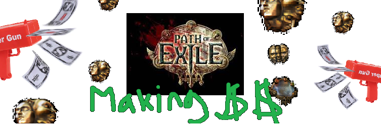

# An Analysis of the Path of Exile League Economy


### Introduction

<p> Path of Exile (PoE) is a MMOARPG (Massively Multiplayer Online Action Role Playing Game) developed by Grinding Gear Games. Released in 2013, with the support of crowdfunding, the game has since grown greatly, having hundreds of thousands of players playing with the release of each patch. One of the biggest differences from other games is that in most MMOs one would kill monsters and expect some sort of monetary reward like gold. However, in PoE killing monsters rewards players with a variety of orbs which serves as the currency. These currency orbs are not only currency, but double as a usable item which can be used to affect items, for example: Chaos orbs which removes all the stats on an item and rerolls completely new stat values and properties. The inherent value in these currencies comes from how they are essentially used to gamble on items, with players trying to use them in order to try and upgrade their items to be stronger. However conversely, players can also just save up currency and buy a better item from another player.
</p>

<div> Path of Exile operates on a system that is known as Leagues. Roughly every 3 months the game receives a major patch which introduces new mechanics, items, and content but also wipes out all existing characters and items from the previous league. This gives the economy of the game a fresh start every 3 months, which allows us to track trends in the valuation of currency across leagues. While the prices of relative price of currency items tends to stabilize as each league progresses, the first month’s economy is incredibly volatile, and a lot of money can be made by understanding the demand for currency items and correctly playing the market. 
</div>

<p> Another thing to note is that in PoE, people tend to pay for convenience. Unlike most	games, there is not actual in-game designated marketplace. People have to search up on a 3rd party website, for what they want, then message the player for it, and then go to their “hideout” to trade with them. This makes it so that people who want to buy bulk amounts of items, tend to pay a premium to spare them the inconvenience of having to go out of their way to complete multiple trades with different people. This allows for a certain margin of upricing that can be deemed acceptable by the buyer, thus allowing the seller to generate higher profit margins. Because of this bulk upricing, the seller holds an upper hand in trades, and has far more power in dictating price.
</p>
> An example of this would be that if you wanted to buy 1000 pencils online and there were only 2 listings in existence. The first is that you could buy all 1000 pencils in 1 transaction for $1000, or you could buy 1 pencil at a time for $0.95. While some people would be ok with wasting time clicking 1000 times, a lot of people would just pay the extra $50 to spare them the pain. 

Poeninja is a webstie which has been logging trade data for each league since 2017. Using their datasets found at: https://poe.ninja/data, we are going to be taking data from the previous 5 leagues: Blight, Legion, Synthesis, Betrayal, and Delve. Our tutorial is going to be looking at the ratios between currency items on the market, and observing what trades can be deemed as profitable.

### Getting Started

<p> We are going to be utilizing the following imported libraries
 </p>
```python
import pandas as pd
import numpy as np
import matplotlib.pyplot as plt
```

## Preprocessing the Data

```python
legion = pd.read_csv("Legion.2019-06-07.2019-09-02.currency.csv", sep=',')
legion.head()
```


<div>
<style scoped>
    .dataframe tbody tr th:only-of-type {
        vertical-align: middle;
    }

    .dataframe tbody tr th {
        vertical-align: top;
    }

    .dataframe thead th {
        text-align: right;
    }
</style>
<table border="1" class="dataframe">
  <thead>
    <tr style="text-align: right;">
      <th></th>
      <th>League</th>
      <th>Date</th>
      <th>Get</th>
      <th>Pay</th>
      <th>Value</th>
      <th>Confidence</th>
    </tr>
  </thead>
  <tbody>
    <tr>
      <td>0</td>
      <td>Legion</td>
      <td>6/7/2019</td>
      <td>Orb of Alchemy</td>
      <td>Chaos Orb</td>
      <td>0.34000</td>
      <td>High</td>
    </tr>
    <tr>
      <td>1</td>
      <td>Legion</td>
      <td>6/8/2019</td>
      <td>Orb of Alchemy</td>
      <td>Chaos Orb</td>
      <td>0.27347</td>
      <td>High</td>
    </tr>
    <tr>
      <td>2</td>
      <td>Legion</td>
      <td>6/9/2019</td>
      <td>Orb of Alchemy</td>
      <td>Chaos Orb</td>
      <td>0.27028</td>
      <td>High</td>
    </tr>
    <tr>
      <td>3</td>
      <td>Legion</td>
      <td>6/10/2019</td>
      <td>Orb of Alchemy</td>
      <td>Chaos Orb</td>
      <td>0.32258</td>
      <td>High</td>
    </tr>
    <tr>
      <td>4</td>
      <td>Legion</td>
      <td>6/11/2019</td>
      <td>Orb of Alchemy</td>
      <td>Chaos Orb</td>
      <td>0.32196</td>
      <td>High</td>
    </tr>
  </tbody>
</table>
</div>

<p>
The above table is the dataset for the Legion League. The columns are:
</p>
 - League
 - Date
 - Get: What the buyer is trying to buy
 - Pay: The currency with which the buyer is paying in
 - Value: How many of the currency the buyer must pay for 1 of the "Get" item
 - Confidence: Poeninja's confidence in the value

